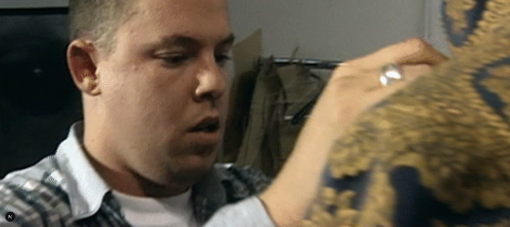

# Fashion Channel

Manage your favorite fashion runways and designers. [https://fashion-channel-swart.vercel.app/](https://fashion-channel-swart.vercel.app/)

> Backend API: [https://github.com/brandonporcel/fashion-api](https://github.com/brandonporcel/fashion-api)

## Install

```bash
git clone https://github.com/brandonporcel/fashion-channel.git
cd keep-code
npm install
npm run dev
```

## To-Do

- [ ] Web transitions
- [ ] Manage authentication to save runways
- [ ] Implement skeleton loading or suspense for items
- [ ] Rich text editor react for runway description
- [ ] Make view for admin to validate runways and brands (or just to others users to approve 🤔)
- [ ] Youtube searcher in runway form instead of paste link
- [ ] Implement gallery for clicking images
- [ ] Handle tags for runways
- [ ] Implement SWR
- [ ] Static props

---

## Contributing

Contributions are always welcome! Feel free to submit issues or pull requests.

## Feedback

I’d love to hear your thoughts! Contact me via [mail](brandon7.7porcel@gmail.com) or [linkedin](https://www.linkedin.com/in/brandonporcel/)

<!--
https://shu-gallery.vercel.app/
 -->
